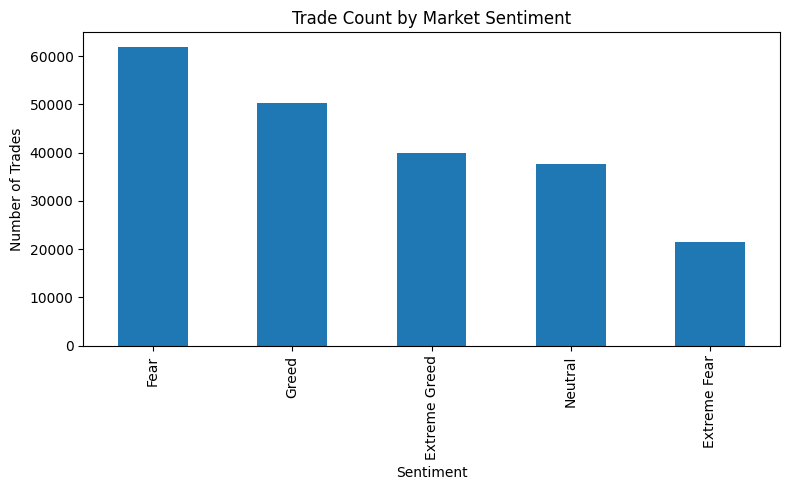
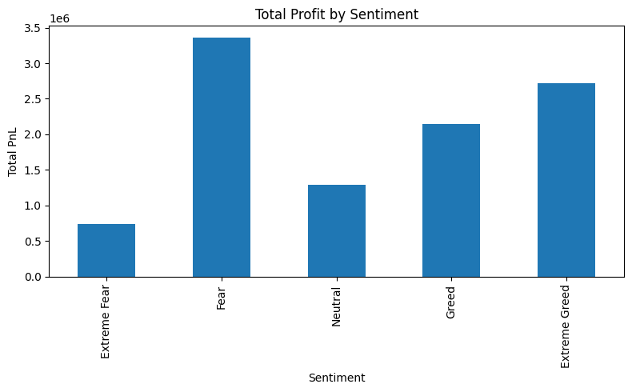
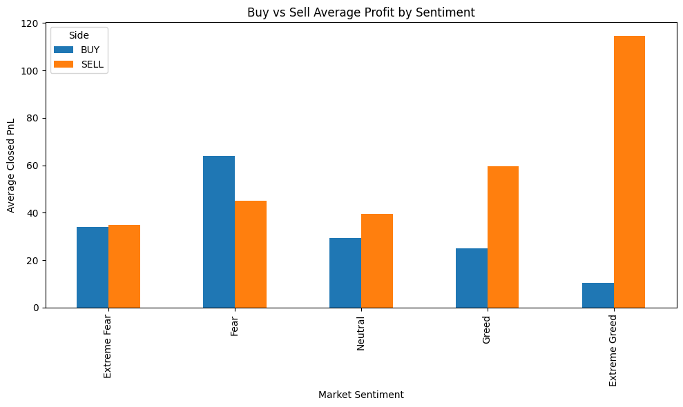
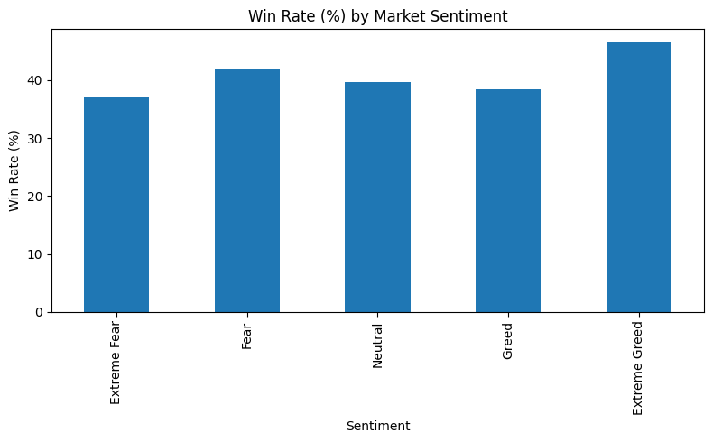

# Trader Behavior Analysis Under Market Sentiment Conditions

## Project Overview
This project investigates the correlation between prevailing Bitcoin market sentiment (measured by the Fear & Greed Index) and retail trader performance. By merging daily sentiment classifications with raw trade execution logs, this analysis identifies how different market regimes impact profitability, position sizing, win rates, and directional bias.

The resulting insights challenge common assumptions about retail trading behavior, demonstrating that optimal strategies are inherently contrarian and highly dependent on the broader market environment.

## Technologies & Tools Used
*   **Python:** Core data manipulation and analysis
*   **Pandas:** Data cleaning, merging, and aggregation
*   **Matplotlib:** Data visualization and chart generation
*   **Jupyter Notebook / Python Script:** Execution environment

## Key Findings
1.  **Fear Drives Participation:** The "Fear" regime recorded the highest trade volume (61,837 trades) and the largest average position sizes ($7,816), yielding the highest total aggregate profit ($3.36M).
2.  **Extreme Greed Drives Efficiency:** Traders achieved the highest win rate (46.49%) and highest average profit per trade ($67.89) during Extreme Greed, despite committing the smallest average capital per trade.
3.  **Contrarian Bias Outperforms:** BUY positions generated the strongest returns during Fear, while SELL positions massively outperformed during Greed and Extreme Greed.
4.  **Profit Concentration:** The dataset exhibited severe performance dispersion, with a single top trader generating $2.14M of the total aggregate profit.

## Visual Insights

### 1. Trade Count by Market Sentiment


### 2. Total Profit by Sentiment


### 3. Buy vs Sell Average Profit by Sentiment


### 4. Win Rate (%) by Market Sentiment


## Project Structure
*   `historical_data.csv` - Raw trade execution data from Hyperliquid.
*   `fear_greed_index.csv` - Historical daily Bitcoin sentiment data.
*   `sentiment_analysis.py` - The main Python script containing the data cleaning, merging, and visualization logic.
*   `sentiment_summary.csv` - The exported aggregate metrics table.
*   `Amaan_Kidwai_Trader_Behavior_Analysis.pdf` - The final business intelligence report summarizing the methodology and insights.

## How to Run the Code
1. Clone this repository to your local machine.
2. Ensure you have the required libraries installed:
```bash
   pip install pandas matplotlib
